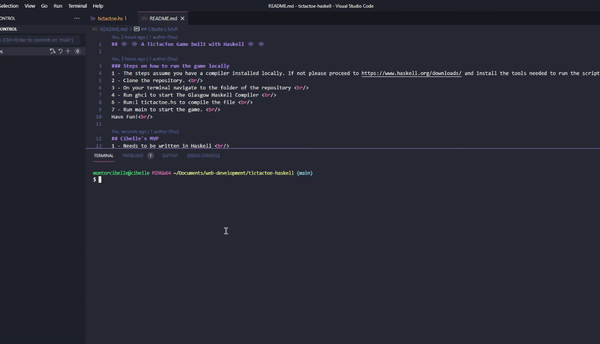

## 👾 👾 A TicTacToe Game built with Haskell 👾 👾

### Steps on how to run the game locally
1 - The steps assume you have a compiler installed locally. If not please proceed to https://www.haskell.org/downloads/ and install the tools needed to run the script.  
2 - Clone the repository.  
3 - On your terminal navigate to the folder of the repository  
4 - Run ghci to start The Glasgow Haskell Compiler  
6 - Run:l tictactoe.hs to compile the file  
7 - Run main to start the game.  
Have Fun! 

## Cibelle's MVP
1 - Needs to be written in Haskell   
2 - A visual representation of the board is displayed in the CLI  
3 - Only create a new board if the player chooses a position that was not yet taken  
4 - User is made aware of the position they are trying to choose is not available  
5 - User knows whose turn is it 

## Future implementations :
1 - A game setup where users can enter their name  
2 - A score table that keeps track of winners/losers  
3 - Refactoring. Get rid of redundant code. Make it cleaner.  

## Demo

## Notes
Any suggestions on How I can improve the game or/and my code? Let me know.   
This is my first attempting writing in Haskell. The goal of this exercise is to learn about a different Programming Language Paradigm.  
